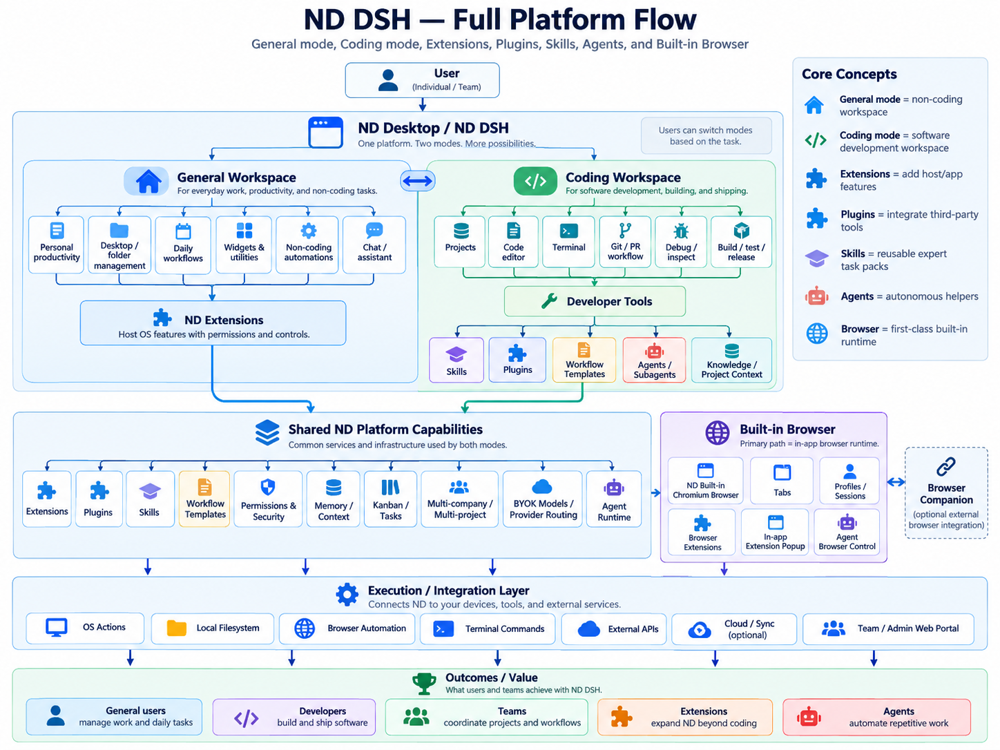
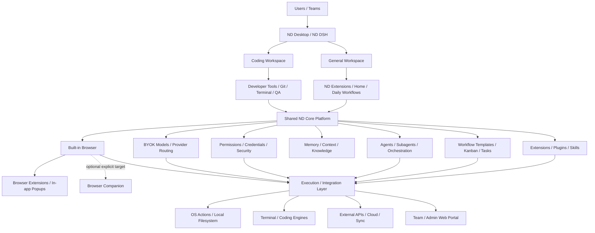
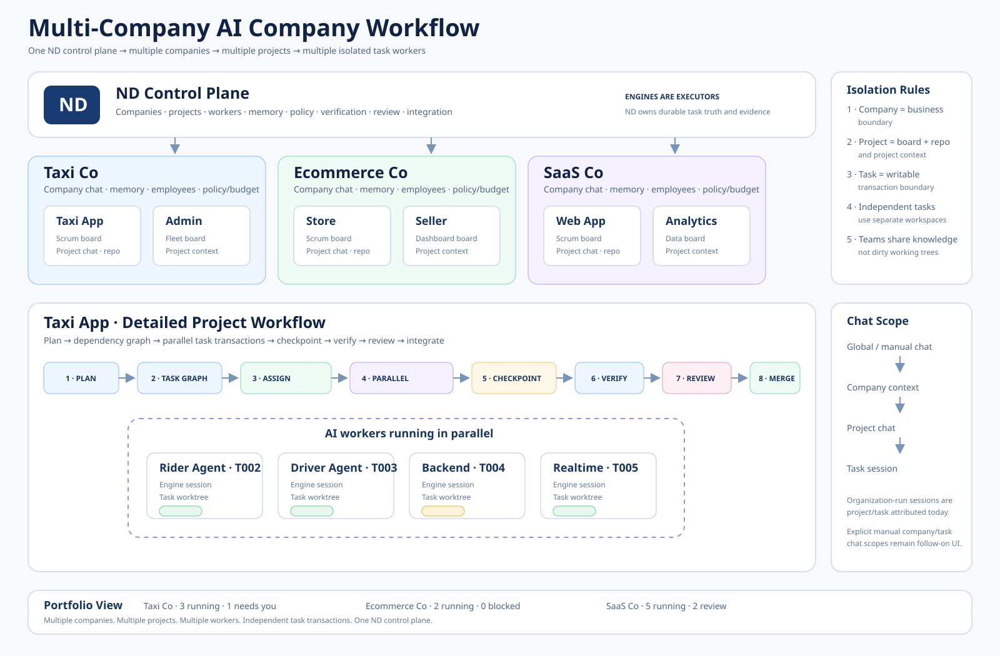

# ND-DSH

> **Local-first AI work desktop. General work + software delivery + extensions + agents, with replaceable model and coding-engine runtimes.**

ND-DSH is a desktop **AI workspace and company operating platform** for everyday work, software development, automation, extensions, agents, and governed browser automation. Instead of treating an AI model as a single chat box, ND owns contexts, companies, projects, roles, teams, agents, tasks, workflows, skills, memory, policies, model-provider routes, browser state, and coding-engine capabilities.

> **⚠️ Status: Developer Preview / Private Beta.**
> The core loop runs on real desktop/runtime state, but there is no signed public installer or broad stability promise yet. Use it with supervised beta workflows and expect breaking changes. See [What we ship and what's planned](#what-we-ship-and-whats-planned) and the [Roadmap](#roadmap).

ND started coding-first. The desktop now exposes two human-facing workspace profiles over the same governed runtime:

- **General** — non-coding work: Home, chat/agents, files and folders, projects, browser, knowledge, design, launcher, daily workflows and ND Extensions.
- **Coding** — General plus the coding workbench, Git, terminal, QA/test surfaces, source tooling, task workspaces, code agents and coding-engine controls.

Switching General ↔ Coding is a presentation change. It must not pause, cancel, restart, or silently re-scope already-running company/task/agent execution.

Both profiles share ND's extension/plugin/skill registries, workflow templates, memory/context, Kanban/tasks, company/project boundaries, permissions, credential handling, BYOK/provider routing, and agent runtime.

The primary browser path is the **ND built-in browser**: an ND-owned persistent Chromium session with real tabs, profile/session state, governed automation and a browser-extension layer. The **Browser Companion** remains a separate, optional target for a user's existing external Chrome/Chromium profile. ND Pencil remains the native Freeform design surface for the active project's real source.



## Platform architecture



The detailed implementation map lives in [`docs/architecture.md`](docs/architecture.md). The core distinction is that **ND Extensions**, **plugins**, **skills**, and **browser extensions are different capability classes** even though they can participate in the same workflows.

| Concept | ND meaning |
| --- | --- |
| **General Workspace** | Non-coding productivity, daily operations, files/folders, browser, knowledge, chat and extensions |
| **Coding Workspace** | General capabilities plus code, terminal, Git, QA, debug/build/release and coding-engine workflows |
| **ND Extensions** | Manifest-governed host/app capabilities, commands, typed views and workflows mediated by ND permissions |
| **Plugins** | Third-party integrations/adapters connected through ND capability and permission boundaries |
| **Skills** | Reusable expert task/context packs that agents can invoke when needed |
| **Workflow templates** | Reusable task/process patterns with explicit context, approvals and automation rules |
| **Agents / Subagents** | Autonomous helpers orchestrated under ND context, budget, permission and audit rules |
| **Browser extensions** | Supported Chromium extension packages loaded into the ND built-in browser profile |
| **Browser Companion** | Optional external-browser integration for an explicitly selected existing Chrome/Chromium profile |

## Product boundary

ND-DSH is the product and control plane. Runtime vendors are replaceable implementation dependencies.

```text
ND-DSH desktop UI
        |
        +--> General workspace
        +--> Coding workspace
        |
        v
ND context / company / project / role / agent / task control plane
        |
        +--> ND Extensions / plugins / skills / workflows
        |
        +--> ND built-in browser + optional Browser Companion
        |
        +--> ND provider routes
        |      +--> DeepSeek compatibility route
        |      +--> OpenAI-compatible routes
        |      +--> Responses-compatible routes
        |      +--> Anthropic-compatible routes
        |      +--> provider-native/catalog routes
        |
        +--> ND coding-engine registry
               +--> ND Harness
               +--> Codex CLI (direct + delegated)
               +--> ZCode / Antigravity / Pi / Cursor / Claude Code
               +--> OpenCode / Goose / JCode / Hermes
               +--> interactive-only engines such as ChatGPT Web / MiniMax
               +--> future local or remote engine adapters
```

ND owns identity, configuration, authorization, orchestration, and durable state. Coding engines own execution details such as the agent loop, shell/process mechanics, filesystem operations, model transport, and product-specific protocol handling.

## Multi-company workflow

One ND desktop can own **multiple companies**. Each company can own **multiple projects**, and each project can run **multiple workers/tasks** concurrently when dependencies, policy, capacity, and write-scope checks allow it.



The operating hierarchy is:

```text
ND control plane
├── Company A — business boundary
│   ├── company teams / employees / memory / policy / budget
│   ├── Project A1 — board + repo/workspace + project context
│   │   ├── Task 1 -> lease -> engine session -> isolated task worktree
│   │   ├── Task 2 -> lease -> engine session -> isolated task worktree
│   │   └── Task 3 -> lease -> engine session -> isolated task worktree
│   └── Project A2
└── Company B
    ├── Project B1
    └── Project B2
```

The boundaries are deliberate:

- **Company = business boundary.** Roles, teams, employees, policy, budget and company memory never silently cross companies.
- **Project = delivery/context boundary.** A project owns its board, goals, repository/workspace, project memory, runtime and organization-session view.
- **Task = writable transaction boundary.** Independent writable tasks get independent ND-managed workspace/checkpoint lineage even when their files appear disjoint.
- **Team = coordination boundary, not a dirty-tree boundary.** Workers can share decisions, blockers and handoffs while their independent task output stays rollbackable.
- **Engine session = replaceable execution context.** ZCode, Codex, Claude Code, Cursor and other engines perform work; ND remains authoritative for leases, checkpoint, verification, review and integration.

Switching the human UI from Taxi Co to Ecommerce Co does not redefine ownership of already-running task sessions. Background organization work remains attributed to its company/project/task, while the active UI filters to the selected company/project. Organization-run chats are project-attributed today; plain manual chats without organization attribution remain global until explicit Global/Company/Project/Task manual-chat scoping is added.

## Current coding engines

### ND Harness

The primary engine is the DeepSeek Harness runtime, tracked to upstream latest and used as infrastructure rather than product identity. ND adds its own provider routing, workspace scope, permissions, browser MCP, agent preset, organization context, and desktop lifecycle around it.

Upstream runtime: **tracks latest** — `deepseek-ai/deepseek-harness` `master`, synced at bootstrap or via `corepack pnpm dsh:update`.

### Codex CLI (direct)

ND's main process spawns and manages the official Codex app-server itself, using the `@openai/codex` package pinned inside the vendored runtime (`ND_DSH_CODEX_BINARY` is a developer-only override). Each chat is a native Codex thread; progress streams into the workbench chat panel, interactive threads can request human approvals through ND's approval cards, and unassigned-to-Codex organization runs execute directly on this engine with a fail-closed `never` approval policy.

Native Codex authentication, `HOME` / `CODEX_HOME`, model selection, project trust, and account settings remain authoritative. ND strips its own runtime variables before spawning and never copies model-provider API keys into Codex credentials. Threads are in-memory per app run for now, so the catalog honestly reports persistent sessions as unavailable.

### Codex CLI (delegated fallback)

The vendored Harness also contains `@deepseek-ai/dsh-subagent-codex`, which starts its package-local `codex app-server --stdio` process as a one-shot delegate inside an ND Harness run (engine id `codex`). It remains available as a fallback when the direct engine is not usable.

### Other direct CLI engines

The same engine/session contract also supports installed **ZCode CLI, Antigravity CLI, Pi CLI, Cursor CLI, Claude Code CLI, OpenCode, Goose, JCode, and Hermes** when their native CLIs are available. Authentication, provider/model selection, project rules, and vendor permission policy remain native to each engine. Browser-only/model-only adapters stay interactive and are not advertised as organization workers unless they expose a real ND workspace boundary.

AI employees can be assigned an available workspace-capable coding engine from Workforce. The assignment is durable ND state. Engine-specific worker guidance stays in engine descriptors, while organization workflow code reasons about the common ND contract rather than vendor ids.

## AI company workflow

A normal autonomous delivery cycle is:

```text
Company objective
      |
      v
AI PM plan -> task/dependency graph
      |
      v
Ready independent tasks
      |
      +-------------------+-------------------+
      v                   v                   v
 Task A                Task B              Task C
 lease/worktree        lease/worktree      lease/worktree
 engine session        engine session      engine session
      |                   |                   |
      +--------- execute safely in parallel --+
                          |
                          v
                 checkpoint exact output
                          |
                          v
                   machine verification
                          |
                          v
                  independent review
                          |
               +----------+-----------+
               |                      |
             PASS                 REWORK/BLOCK
               |                      |
               v                      +--> preserved task lineage
          integration queue
               |
        merge or explicit
       integration-conflict
               |
               v
       durable result/memory
       + dependency unlock
```

Company autonomy levels control how much of that workflow may continue without another explicit human start. Approval-bearing organization runs pass through the ND main-process policy gate before a human approval card can be shown or resolved.

## Development setup

Requirements:

- Node.js 24+
- pnpm 11 through Corepack
- Git
- a supported Electron desktop OS

Clone with submodules, or let bootstrap initialize the Harness checkout and sync it to upstream latest:

```sh
git clone --recurse-submodules https://github.com/zila-kh/nd-dsh.git
cd nd-dsh
corepack enable
corepack pnpm bootstrap
corepack pnpm dev
```

Configure model providers from **Settings -> Models**. `DEEPSEEK_API_KEY` remains an optional compatibility environment variable for the seeded DeepSeek route. Desktop API keys entered through Settings are stored with Electron OS-backed secure storage when a secure backend is available.

During development, opening the Vite renderer URL (normally `http://localhost:5173`) in a regular browser shows an explicitly labeled **UI Preview** populated with simulated fixtures. It exists only for reviewing navigation, layout, responsive behavior, and interaction states; agents, workspaces, Git, providers, ND Pencil, the shared browser, and organization runs function only in the Electron application. Preview fixtures are development-only and are not bundled as a production runtime fallback.

Existing stored API keys are not returned to the renderer. Settings receives only whether a credential exists and uses dedicated replace/clear operations. If a secure operating-system store is unavailable, a newly entered key remains memory-only rather than being persisted insecurely.

Codex authentication is native to Codex. The ND adapter does not create or migrate a Codex account.

## Verification

Before publishing a change:

```sh
corepack pnpm verify
corepack pnpm typecheck
corepack pnpm test
corepack pnpm core:test
corepack pnpm build
```

End-to-end specs drive the real built app through Playwright's Electron launcher; they run locally (not in CI) and need a fresh production build first:

```sh
corepack pnpm build
corepack pnpm e2e
```

The QA view in the app runs the same unit and e2e suites from inside ND-DSH and streams their output; it requires a development checkout with runners installed.

Routine gates currently run **locally**: GitHub Actions is parked as `.github-bk/` to conserve compute until the product is stable enough to justify it — renaming the folder back restores the workflows unchanged. Until then, the verification commands above (plus `corepack pnpm core:test` and the E2E suites) are the release gate.

## Syncing the Harness runtime

The Harness submodule tracks upstream latest instead of a frozen pin while ND-DSH is in beta. Every `corepack pnpm bootstrap` syncs it to the newest upstream commit, and you can re-sync on demand:

```sh
corepack pnpm dsh:update                          # sync to upstream latest
corepack pnpm dsh:update -- <tag-or-commit>       # optional explicit ref for debugging/downgrades
```

Review the resulting runtime/config compatibility against the ND overlay and adapters, run the checks below, and commit the moved submodule gitlink together with any adapter fixes. Provenance of the last sync (branch, commit, release) is recorded informationally in `vendor/deepseek-harness.json`; nothing enforces a specific commit.

## Project status

**ND-DSH is a Developer Preview / Private Beta.** Supervised source-build and staged-runtime workflows are available, but a signed public installer, installed-app coverage, and a broad compatibility guarantee are still pending; expect breaking changes.

What exists today is a real running slice: the app runs on actual desktop/runtime state with no production fallback to mock companies, fake sessions, fake workspaces, or a localhost demo page, and the renderer fails closed if its trusted desktop bridges are missing. As of 2026-09-24 every locally-runnable gate is green on the current tree: repository verification, typecheck, 841 unit tests, Rust `core:test`, the full Playwright sweep, a real-user production E2E journey across companies/parallel modes/restart, a portable Windows build with packaged runtime smoke and a forced-core-crash cleanup proof, and benchmark contract/budget checks against the committed baseline. Release validation that needs a Windows CI runner is explicitly tracked as [blocked-0004](docs/tasks/blocked-0004-windows-release-validation.md).

A **Public Beta** still requires the remaining P0 gates — restored CI with runner-attested release evidence, signed installers with an update channel, a clean-machine offline runtime proof, installed-app E2E against the packaged artifact, and the real-Chrome companion smoke. The ordered checklist lives in [`docs/plan/beta-release-readiness.md`](docs/plan/beta-release-readiness.md); normalized action metadata for policy enforcement beyond Harness approval frames remains the pre-GA gate.

## What we ship and what's planned

| Area | Status | Detail |
| --- | --- | --- |
| Desktop shell | 🚢 Shipped | Secure Electron/React desktop; renderer fails closed without trusted bridges |
| General / Coding workspace profiles | 🧪 Beta | Two human-facing profiles over the same ND identity, context, agent and execution state; switching profiles is presentation-only |
| ND Extensions / Home / command registry | 🧪 Beta | Manifest-governed Personal/Company/Project contributions, launcher commands, typed views and narrow native host capabilities; human validation remains |
| Model routing | 🚢 Shipped | Provider-neutral routes: DeepSeek, OpenAI-compatible, Responses-compatible, Anthropic-compatible |
| Provider credentials | 🚢 Shipped | OS-backed encrypted storage when available; write-only from the UI (replace/clear, never read back) |
| Organization state | 🚢 Shipped | Multiple companies/projects with scoped teams, roles, AI employees, goals, milestones, tasks, memory, policies, run receipts and coordination events |
| Parallel task isolation | 🚢 Shipped | Independent writable tasks use ND-owned Git worktrees, baseline/checkpoint provenance, targeted rollback, verification and fail-closed integration |
| Delivery loop | 🚢 Shipped | AI PM → dependency graph → parallel workers → checkpoint → machine verify → independent review → integration/rework |
| Coding engines | 🚢 Shipped | ND Harness; direct Codex, ZCode, Antigravity, Pi, Cursor, Claude Code; installed OpenCode/Goose/JCode/Hermes adapters; delegated Codex fallback |
| Source Control | 🚢 Shipped | Built-in Git panel (status groups, stage/commit, diffs, branches, fetch/pull/push) derived from microsoft/vscode extensions/git (MIT) — see [`docs/source-control.md`](docs/source-control.md) |
| Rust core runtime | 🚢 Shipped | Single production runtime `nd-core` (Rust sidecar): runtime permits, process/PTY lifecycle, durable effect journal with restart replay, decision-kernel contract — organization truth stays ND/TypeScript-owned |
| Unified browser platform | 🚢 Shipped | ND built-in multi-tab browser is the primary target; Browser Companion is an optional explicit external Chrome/Chromium target behind the same governed BrowserTarget/router contract |
| In-app browser extension runtime | 🧪 Beta | Extensions load into the ND-owned browser session with in-app toolbar/action popups; broader compatibility is evidence-gated and never falls back to external Chrome |
| ND Pencil | 🚢 Shipped | Native Freeform design surface (bundled `resources/nd-pencil`, sandboxed child view) editing the active project's real source — see [`docs/nd-pencil.md`](docs/nd-pencil.md) |
| Policy gate | 🚢 Shipped | Main-process DENY/ALLOW/ASK enforcement for approval-bearing organization runs |
| Packaging & installers | 🛠 Planned | Portable Windows build with bundled runtime (ND Core, Harness closure, ND Pencil, agent-browser) verified locally; signed/notarized installers, an update channel, and clean-machine offline install are still pending |
| Codex onboarding | 🛠 Planned | Native authentication and health checks in first-run onboarding |
| More execution providers | 🛠 Planned | Additional local/offline and remote/cloud workers behind the same ND task/workspace/evidence contract |
| Broader company templates | 🛠 Planned | Non-coding business roles once the software-company loop is reliable |

## Roadmap

The full, ordered roadmap lives in [`docs/roadmap.md`](docs/roadmap.md), and the complete feature inventory / product requirements for contributors live in [`docs/prd-full.md`](docs/prd-full.md). Summary:

1. **Shipped foundation** — real company/project/task execution, coding engines, Rust core, built-in browser baseline, source control and design surface.
2. **Current beta expansion** — General/Coding workspace profiles, ND Extensions/Home, shared command registry, governed native capabilities and first-class in-app browser extensions.
3. **Public Beta P0** — runtime distribution, signed installers, installed-app E2E, onboarding and runner-attested release evidence.
4. **After the beta** — more engine adapters, broader action metadata for policy, cloud/sync options and broader company templates.

## Security boundaries

- Renderer: context isolation on, Node integration off, sandbox on.
- Built-in browser: ND-owned persistent Chromium session composed of sandboxed Electron `WebContentsView` tabs; site permissions deny by default.
- Browser extensions: supported packages load into the same ND browser session. Extension action popups stay inside the ND window; built-in extension execution never silently falls back to external Chrome.
- Browser automation: attaches to the exact visible ND tab through loopback CDP; no hidden second browser. Browser Companion is an explicit optional target, not the built-in runtime.
- ND Pencil: sandboxed, context-isolated child view; the managed engine binds to loopback only with a per-instance token/allowed-origin contract, denies popups/permissions, and blocks upstream authentication, collaboration, and built-in AI routes.
- IPC: main-frame sender validation and narrow contracts.
- Workspace: path containment and symlink protections.
- Provider credentials: separated from provider metadata, encrypted at rest when OS secure storage is available, and never returned to React after storage.
- Codex delegated mode: fail-closed `never` approval policy by default; dangerous bypass is not selected by ND.
- Organization state: atomic writes, last-known-good backup, validation, and interrupted-run reconciliation.
- Task isolation: independent writable organization tasks use ND-owned task worktrees; rollback/clean targets only the known task workspace, never a dirty human checkout.
- Engine workspace binding: a writable direct-engine session cannot silently move from its ND-bound task workspace to another checkout.
- Organization approvals: explicit company DENY/ALLOW/ASK decisions are enforced in the main process for approval-bearing Harness runs; uncertain classifications fail back to human ASK.

## Repository layout

```text
src/main/                 Electron main process and ND services
src/main/organization/    AI company durable state, orchestration, policy gate
src/main/engines/         coding-engine catalog and employee assignments
src/main/harness/         primary Harness adapter
src/main/browser/         ND built-in Chromium tabs/profile/extension runtime + agent-browser integration
src/main/browser-platform/ unified BrowserTarget routing, policy, credentials and extension management
src/main/extensions/      ND extension packages, lifecycle and trusted invocation broker
src/preload/              trusted renderer bridge
src/renderer/             ND product UI
src/shared/               cross-process contracts
configs/dsh/              ND Harness overlay and agent preset
.dsh/skills/              repository-local ND skills
tests/                    product/unit contracts
vendor/deepseek-harness/  runtime submodule (tracks upstream latest)
crates/                   Rust core: nd-protocol, nd-runtime, nd-core, nd-browser-host
resources/nd-pencil/      bundled ND Pencil engine (pinned upstream source: vendor/openpencil)
```

## License

Released under the **MIT License** — see [`LICENSE`](LICENSE). DeepSeek Harness and Codex remain third-party runtime dependencies governed by their respective licenses and distribution terms. Packaged builds ship an aggregated `THIRD_PARTY_NOTICES.nd-dsh.md` (generated at release staging from the actual dependency closure) alongside each bundled runtime's own license notices.

---

> **ND-DSH** — General + Coding workspaces on one governed local-first AI platform. Replaceable models and coding engines. · *Developer Preview / Private Beta.* · [Architecture](docs/architecture.md) · [Roadmap](docs/roadmap.md) · MIT License
